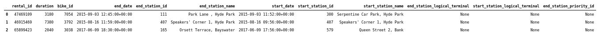
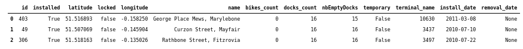
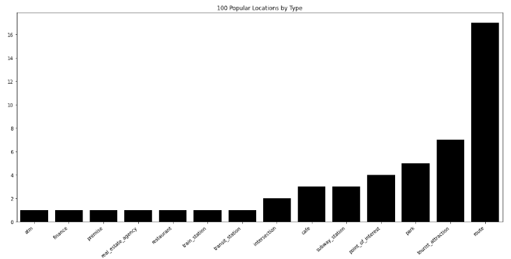
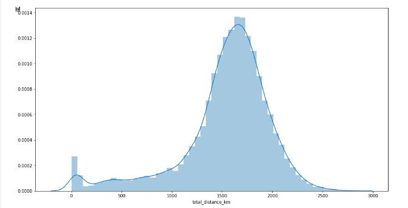
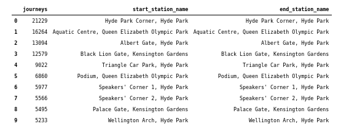

# London Santander Cycle Hire

Exploratory analysis of London's Santander Cycle Hire Scheme data.

 

Credit: Photo by Alessandra Caretto on Unsplash.

### Introduction

Santander Cycles is a public bicycle hire scheme in London, United Kingdom. The scheme's bicycles are most popularly known as Boris Bikes, after then-Mayor of London, Boris Johnson, who introduced them during his tenure. The success of the hire scheme can be measured in many ways, easing the strain on the public transport system; getting Londoners active and fit, and good old-fashioned fun. bicycles is difficult, how can data help us? 

In this article we will answer the following questions:
- How many kilometers are travelled per month on Boris Bikes (as the crow flies)?
- How many kilometers does the average bike travel in a year (as the crow flies)?  
- Which location is most popular?  
- What is special about the popular locations?

This data is publicly available through Google's BigQuery. Data includes start and stop timestamps, station names and ride duration. BigQuery is serverless, highly scalable, and cost-effective cloud data warehouse designed for business agility and provides 1TB of free queries per month. In the following analyses we will focus on the year 2016.

#### Sample data

Below is a sample of the data available in Google BigQuery, the `cycle_hires` table is 2.6GB and 24.4M rows. Since the datasets are fairly large we will use BigQuery for the majority of data processing and load smaller chunks of data into memory. The `cycle_hires` table contains timestamps and station ids for individual bike hires, and the `cycle_stations` table contains information about each station, notably the longitude and latitude which we will use later with the Google Maps API to find out more about ech location.

 

Sample of cycle_hires table

 

Sample of cycle_stations table

#### How many kilometers are travelled per month on Boris Bikes?

To derive the total distance travelled we can use the number of journeys between two stations multiplied by the distance between the stations. To calculate the distance we can use can BigQuery's native functions that enable us to calculate the haversine distance between to sets of coordinates.

From the graph below we can see that every month over 1000,000 kilometers are travelled on Boris Bikes. We can see that the peak of travel occurs in the summer months, particularly in July when many tourists visit London. 

 

#### How many kilometers does the average bike travel in a year (as the crow flies)?

The average bike travels 1537 kilometeres per year, with a median of 1614 kilometers per year. We can observe that the distribution is negatively skewed below.

 

#### Which location is most popular?

Below we see that the most popular routes by the number of journeys are near parks, and in particular Hyde Park Corner a leisure spot.

 

Credit: Photo by Yair Aronshtam on CreativeCommons.org.

 

 

Sample of location data.

#### What is special about the popular locations?

Using the Google Places API we can retrieve rich data about locations to understand what is significant about the most popular locations. To do this we make an API call containing the address. The majority of popular locations are merely tagged as 'routes' that are used for transportation. In second and third place we have tourist attractions and parks (like Hyde Park in the example above).

 

### Conclusion

In conclusion, we can see July is the busiest month for cycling in London, with some 2 million kilometers being cycled. In a single year the average bike travels 1537 kilometers as the crow flies Leisure spots like Hyde Park and the Olympic Stadium are locations people frequently cycle around. By combining our dataset with information from the Google Places API we can see the most popular locations are travel routes followed by tourst attractions and parks.
