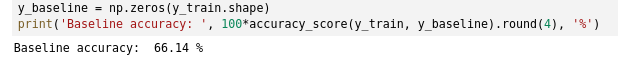

# Starbucks: Predicting Offer Completion

Credit: Mike Kenneally

This post provides information about my Udacity Data Science Nanodegree project.

## Project Overview

Once every few days, Starbucks sends out an offer to users of the mobile app. An offer can be merely an advertisement for a drink or an actual offer such as a discount or BOGO (buy one get one free). Some users might not receive any offer during certain weeks. Not all users receive the same offer.

In this project we derive a target label for offer completion and combine this with demographic and offer data to predict who will complete and offer sent to them. Every offer has an expiration period, and the same offer may be sent multiple times. This means care must be taken when processing and transforming the data. To add additional complexity an offer may be marked as complete despite the person never viewing the offer.

### Problem Definition

Starbucks customers are sent offer codes such as discounts and and buy-one-get-one-free. It’s common industry practice to send offers to improve sales and retain customers. Can we predict which customers will complete the conditions of an offer?

### Problem Statement

Given data regarding customer demographics, offer characteristics and their activity predict which users will complete offers sent to them.

### Evaluation Metrics

To evaluate our predictions we will use accuracy as a metric. The accuracy score is easy to interpret and simple to explain. As an example 60% accuracy means we have correctly classified 60% of the dataset, 100% meaning we have correctly classified the entire dataset.

One draw back of the accuracy score is when working with imbalanced datasets. Suppose we look at clinical trial data to build a model that predicts cancer. Our datasets contains 100 samples, with 2 cancer cases. By predicting that all patients do not have cancer we can achieve 98%. In the context of the problem this metric could be misleading.

We’ll see later that there is a slight class imbalance in our derived dataset. We will create a dummy model to create a benchmark accuracy score that we must beat.

## Data Exploration

The data is contained in three files: `profile.json` , `portfolio.json` and transcript.json . Below we will discuss each file in more detail below and some of the data cleaning tasks carried out based on exploratory work.

### Portfolio

The portfolio file contains offer ids and metadata about each offer like the type, duration and completion difficulty. Below is a short description of each column and the datatype.

- id (string) — offer id
- offer_type (string) — type of offer ie BOGO, discount, informational
- difficulty (int) — minimum required spend to complete an offer
- reward (int) — reward given for completing an offer
- duration (int) — time for offer to be open, in days
- channels (list of strings)

Overall, the portfolio dateset is clean and easy to work with. The only processing required is to one hot encode the channel and offer type columns. To one hot encode the channels column we must parse the arrays to firstly understand all the unique values and then create the one-hot column. The function below provides an overview of how we can parse the lists and derive features.

Sample of offer data

The final step here is to convert duration to hours, for comparison with the transcript data (more on this later).

Function to one-hot encode channels

### Profile

The profile file contains customer-level information, like the customer’s income, gender and age.

- age (int) — age of the customer
- became_member_on (int) — date when customer created an app account
- gender (str) — gender of the customer (note some entries contain ‘O’ for other - rather than M or F)
- id (str) — customer id
- income (float) — customer’s income

Sample of profile data

The profile data contains some missing data and abnormalities, many customers are missing an income and gender value and also have an age of 118. Many models cannot work with `None` and `Nan` values, therefore we impute the values using the median and add a flag is_missing_data=1 for each row. Here we also replace age with the median.

The became_member_on column is currently an integer value, we can convert this to a date to engineer features such as:
- member_year the year the member joined
- member_month the month the member joined
- member_duration_days the duration of membership in days

Function to derive date features

### Transcript

Finally, the transcript contains event-like data including transactions and offer-related information.

- event (str) — record description (ie transaction, offer received, offer viewed, etc.)
- person (str) — customer id
- time (int) — time in hours since start of test. The data begins at time t=0
- value — (dict of strings) — either an offer id or transaction amount depending on the record

Sample of transcript data

The transcript data isn’t particularly clean and needs attention. In particular we need to extract values from the value column into individual fields. The value dictionary contains:

- `offer_id` and `offer id`
- `amount`
- `reward`

The function below extracts the different keys value pairs from the dictionary and creates new columns.

Function to clean transcript data

## Data visualisation

In this section we will discuss the distributions, relationships and abnormalities observed in the data.

### Profiles

In the pair-plot below there are some very interesting structures. I haven’t broken the graphs out into separate images because they are best interpreted together.

In terms of distributions we can see that age is both income and member duration are positively skewed with age looking more normally distributed.

Interestingly, we can see a strange relationship between income and both member duration and age. Observe the steps in the graph below. For income-age our interpretation is that customers below the age of around 40 do not earn less than about 78K. This clear line in the scatter plots is likely due to the synthetic nature of the data and can be used to create bins (or used by a decision tree to derive bins in the data — more on this later). Similarly we can see a similar step in member-duration and income.

Distribution and scatter plot of profile data

Transcript

The transcript data itself is most useful once restructured into a useful format for our goal: predicting offer completion. Below we can see that the vast majority of events relate to transactions taking place. We must be mindful that the `offer_completed` event is not a true representation of the problem we are solving. This is because some offers are completely by chance — without the customer viewing the offer.

Count of events

By joining the portfolio data to the transcript we can understand more about the number of events related to each offer type. Whilst informational offers are the least prominent (by event type) we should take care when pre-processing the data because they cannot be completed.

Count of events by offer type

## Methodology

### Data preprocessing

In the previous two sections we have already mentioned and performed some data-cleaning and processing activities. To recap:

- Parsed a unique list of channels and one-hot encoded the individual channel values
- One hot encoded `offer_type`
- Replaced missing `income` values with the median
- Replaced outliers in the `age` column with the median
- Parsed the `value` dictionary to derive clean analysis-ready columns
- Derived date related features from `became_member_on`

In this section we will focus more on processing the transcript data and the creation of the overall dataset used for model selection and evaluation.

Our goal is to predict which offers a user will complete, therefore we must derive a label `was_completed` . The code below details the end-to-end process, we will discuss each function and how they are used to derive labels for training. The functions below take care to:

- Derive each individual event (offer received, viewed, completed)
- Ensure the offer was viewed before expiration (otherwise the view will be related to an offer that was sent at a different time)
- Ensure the offer was completed before expiration (otherwise the view will be related to an offer that was sent at a different time)
- Ensure the offer was viewed before completion (otherwise the completion is considered invalid, the customer would perform the same action regardless of the offer)

Transcript data manipulation steps

In `create_received_offers_df` we create a dataframe containing `person_id` , `offer_id`, `received_at`, and `expires_at`. We derive the expiration time by merging the dataframe to portfolio on the offer_id . We will use the time components to identify which events were viewed and then completed.

Similarly, we derive all the viewed offers in `create_viewed_offers_df` and join the viewed offers to the received offers so we can filter out any views that occurred after the expiration of the offer (as these views are related to the same offer but one sent at another time).

Finally we repeat the process to derive completed offers and then combine the dataframes into one single dataframe that we can easily combine with our pre-processed `portfolio` and `profile` data.

Below is the data derived from transcript that ensures the causal ordering of events.

Derived `was_completed` label from transcript

Combining all the data yields the following labeled data which can be used for machine learning.

Sample data for machine learning

## Implementation

In this section we will discuss:

- Model benchmarks
- Model selection
- Model evaluation
- Model validation

## Model benchmarks

Before we begin to train and score our model it’s important to derive a performance benchmark. A benchmark helps us understand whether the model is good — like we mentioned earlier an accuracy score of 98% could be good or bad depending on the context.

In our case we derive a simple benchmark by predicting that all offers were not completed. This yields an accuracy score of 66.14%. In plain English, 66.14% of our training samples did not complete the offer, by predicting that every offer was incomplete we are correct 66.14% of the time.

Deriving an accuracy benchmark

## Model Selection

To select a model we fit an untuned Logistic Regression and Random Forest Classifier to our data. This provides us with quick insight into which model is more suited to our problem. Below are the results:

We know that Logistic models are great at modelling linear relationships in data, however this often mean that features need to be specifically catered towards the model. Logistic models are often quick to train which is why I like them. In contrast decision trees are more versatile and capable of deriving more complex relationships at, however this comes at the expense of training speed. The random forest model takes much longer to train meaning slower iteration cycles.

Below are the accuracy scores from cross validation.

Logistic Regression

Above we can see that the logistic model’s accuracy only just outperforms our benchmark of 66.14%, in other words the model is only slightly better than predicting the offer wasn’t completed every time. The model is however, very quick to train.

Random Forest

In contrast, our Random Forest classifier is able to achieve an accuracy score consistently around 75% (+9% on the benchmark) however this comes at the expense of training speed.

## Refinement

To refine our Random Forest Classifier we perform a cross validated grid search. Grid search enables us to search for optimal model parameters and cross validation helps to prevent over fitting.

Below we try a range of parameters to tune the model (see image below):

- max_features — the number of features used in the decision tree
- max_depth — the maximum depth of the decision tree
- n_estimators — the number of trees in the forest

Parameter tuning

### Model evaluation & validation

After performing a grid search we find that the optimal parameters are: max_depth: 10, max_features: None, (use all features) and n_estimators: 250. Notably this give us a cross validated accuracy of 77.8%. A +2.8% gain on the untuned model and +11.8% on the benchmark.

Finally we evaluate our trained model on the test dataset, this enables us to check whether our results are transferable or if the model has overfit on the train data. We see below the score on the dataset is 77.39%, this suggests the model is transferable and was not overfitted. This is +11% to our benchmark accuracy.

Test accuracy

### Justification

I think one of the most interesting aspects of the entire project is how the RandomForestClassifier outperformed the Logistic model. It is well documented that random forest models perform better at capturing non-linear relationships, and this is avenue for future exploration.

## Conclusion 

### Reflection

Our main objective was to predict which users will respond to a given offer. We have outperformed our benchmark score of 66% by +11% with a tuned random forest model. Enabling us to predict offer completion with 77.39% accuracy. I personally enjoyed cleaning the data which gave me clarity around the problem to solve.

In this project we have:
- Transformed and combined datasets to derive a target label for classification
- Engineered features for learning
- Derived a baseline model to benchmark our predictions
- Selected a model suited to the problem (RandomForest)
- Tuned the model using both grid search and cross validation
- Evaluated the model against the test dataset

### Improvement

To further improve the model additional features could be derived and explored, for example we could enrich our existing model with features regarding a person’s transaction history (taking care to avoid data leakage).

Whilst we selected a decision tree over a logistic model a logistic model shouldn’t be ruled out. Logistic regression is easy to interpret and very quick to train, one of the reasons a decision tree may outperform a logistic model is due to how decisions trees can effectively create “bins” in the data with branching logic or deal with categories. This means there may be some features (like categories and bins) we can learn from the random forest model and implement with a logistic model.